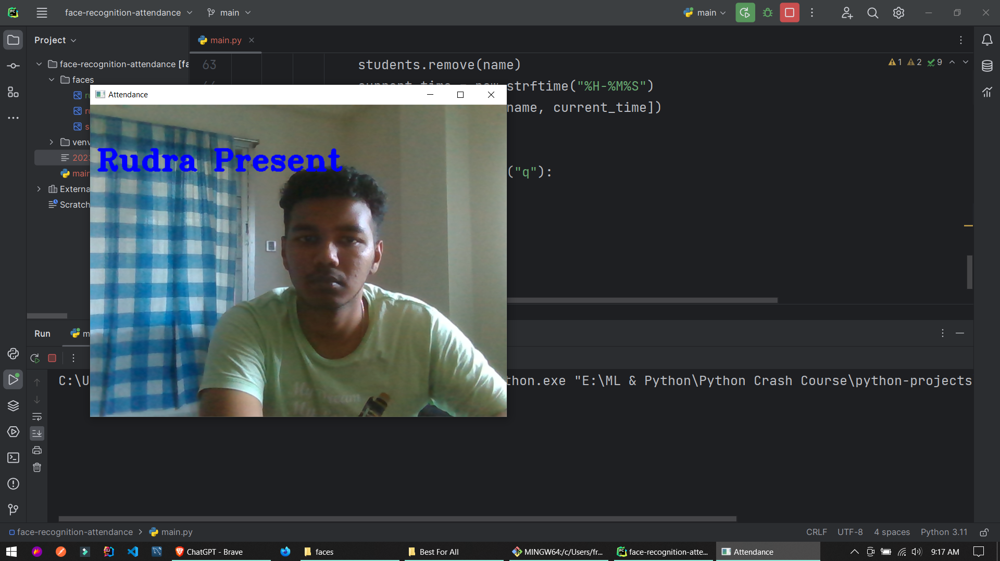

# Face Recognition Attendance System
**Description:** In this project I build a system that actually takes images from the known face folder then encode it then access the webcam and matches. If matches then it print the name of the student in to the webcam display window then record it in the csv file among with time, and the name of the csv file is current date.

**Packages Used:**
* face_recognition
* cv2
* numpy
* csv
* import

## Demo

## About Me
Tech-savvy designer/programmer pushing boundaries of online tech. Passionate about new tools, seeking challenges to advance skills.

## Social Links

